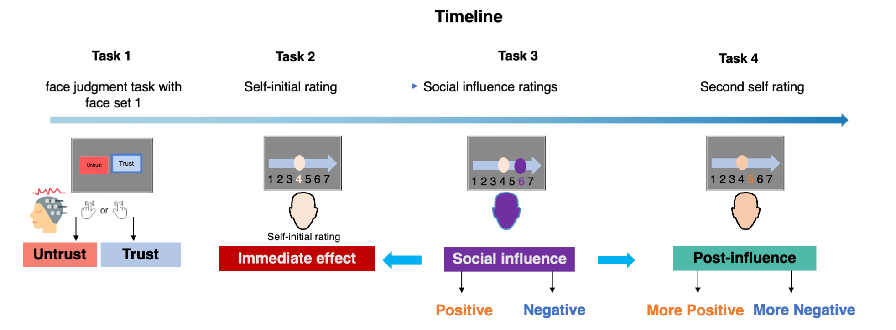
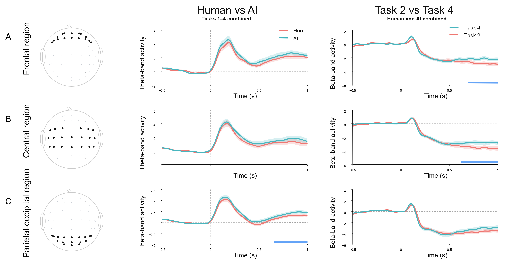
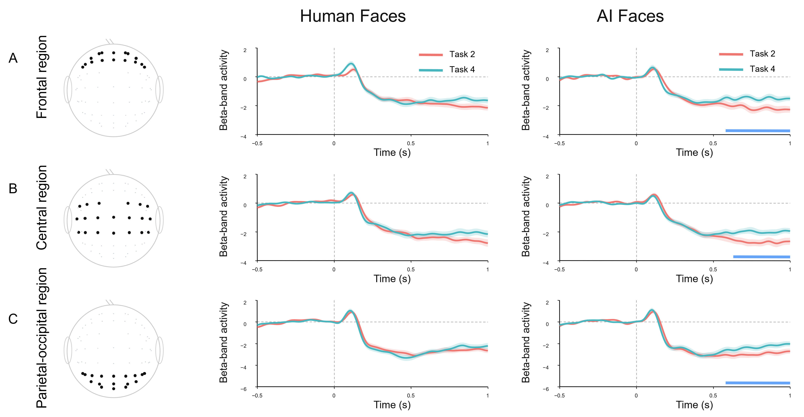

# Social Influence Modulates Trustworthiness Judgments of Human and AI-Generated Faces: An EEG Study

Experimental workflow and selected EEG figures accompanying the manuscript.

**Authors:** Mingxin Shao, Haoming Zhang, Xinyi Xu, Keyu Hu, Jiaming Cao, Xinrui Zhang, Jingmin Qin, and Haiyan Wu  
**Affiliation:** Institute of Artificial Intelligence and Brain Sciences and Department of Psychology, University of Macau, Macau, China

## Overview

This study examines trustworthiness judgments of human and AI-generated faces across four successive stages of evaluation, including exposure to group ratings. Behavioral responses and 64-channel EEG were recorded to characterize differences between face types and changes across task stages.

The study includes an independent stimulus-rating sample (**N = 33**) for selecting facial stimuli and an EEG sample (**N = 38 analyzed**, from 40 recruited participants). Human faces were drawn from the CAS-PEAL database, and AI-generated faces were produced using Stable Diffusion v2.

## Experimental workflow



**Figure 1. Experimental timeline.** The upper portion of the manuscript's Figure 1 shows the four consecutive tasks. Face type refers to the face being evaluated; group ratings provide the social feedback.

| Stage | Stimuli | Procedure |
| --- | --- | --- |
| Task 1 | Face Set 1: higher variability in trustworthiness | Initial evaluation of human and AI-generated faces |
| Task 2 | Face Set 2: lower variability in trustworthiness | Initial trustworthiness ratings before the group-rating phase |
| Task 3 | Face Set 2 | Participants provide ratings and then view group ratings |
| Task 4 | Face Set 2 | Participants re-evaluate the same faces after the group-rating phase |

Task 1 uses a different stimulus set from Tasks 2-4. Task 2 and Task 4 also differ in task order, cumulative exposure, repetition, and time on task. Their contrast therefore does not isolate the causal effect of social feedback.

## Selected findings

### Behavioral responses

In the EEG sample, human faces received higher trustworthiness ratings than AI-generated faces when ratings were averaged across tasks (**M = 4.084 vs. 2.805**, respectively). Ratings of AI-generated faces were higher in Task 1 than in Tasks 2-4, while ratings of human faces remained relatively stable. Ratings of AI-generated faces did not differ significantly among Tasks 2, 3, and 4.

### Main EEG effects



**Figure 4. Main EEG effects.** Rows show frontal, central, and parietal-occipital regions of interest (ROIs). The middle column compares human and AI-generated faces after pooling across Tasks 1-4. The right column compares Tasks 2 and 4 after pooling across face types. Shading indicates the standard error of the mean; blue horizontal bars mark temporal clusters that survived ROI-inclusive false-discovery-rate (FDR) correction.

| Comparison | Corrected temporal-cluster result | Time after face onset | FDR-adjusted q |
| --- | --- | --- | --- |
| Human vs. AI, pooled across tasks | Greater theta power for AI-generated faces in the parietal-occipital ROI | 0.65-1.00 s | .0171 |
| Task 2 vs. Task 4, pooled across face types | Greater beta power in Task 4 in the frontal ROI | 0.69-1.00 s | .0236 |
| Task 2 vs. Task 4, pooled across face types | Greater beta power in Task 4 in the central ROI | 0.62-1.00 s | .0154 |

No within-task Human-AI comparison, Task 1-Task 2 contrast, or planned Task × Face Type interaction survived FDR correction. The findings support differences averaged across tasks and changes associated with task stage; they do not establish preferential frontal-theta conflict monitoring or AI-specific neural updating.

### Beta power by face type



**Figure 3. Beta power before and after the group-rating phase.** Red and teal curves represent Tasks 2 and 4, respectively. Columns show human and AI-generated faces; rows show frontal, central, and parietal-occipital ROIs. Shading indicates the standard error of the mean, and blue bars indicate corrected temporal clusters.

Task 4 showed greater late beta power than Task 2 for AI-generated faces in all three ROIs. No corresponding human-face contrast survived correction. Because the formal Task × Face Type interaction was not significant after correction, this pattern does not establish a larger task-related change for AI-generated faces than for human faces.

## EEG analysis overview

| Component | Approach described in the manuscript |
| --- | --- |
| Recording | 64-channel EEG, sampled at 1,000 Hz |
| Preprocessing | Common average reference, 0.5-30 Hz filtering, independent component analysis, and artifact rejection |
| Time-frequency decomposition | Morlet wavelets; theta (4-7 Hz), alpha (8-12 Hz), and beta (13-29 Hz) |
| Baseline | -0.5 to 0 s relative to face onset; zlogratio normalization and subsequent mean-centering |
| Analysis interval | -0.5 to 1.0 s relative to face onset |
| Scalp ROIs | Frontal: 16 channels; central: 20 channels; parietal-occipital: 17 channels |
| Inference | Within-participant sign-flip cluster-permutation tests with Benjamini-Hochberg FDR correction |

ROI effects describe scalp distributions and do not identify specific cortical sources.

## Files

```text
.
├── README.md
└── figures/
    ├── fig01_experimental_workflow.png
    ├── fig03_beta_by_face_type.png
    └── fig04_main_eeg_effects.png
```

Figure numbers follow the manuscript. Figure 1 is cropped to its upper timeline; Figures 3 and 4 reproduce the complete plotted figures. The images were rendered from manuscript pages 5, 14, and 15 with white backgrounds for readability. This package contains the README and figure assets; analysis scripts and participant data are not included.

## Data requests and contact

The manuscript states that EEG data are not publicly released to protect participant privacy. Data requests and questions about the study should be directed to the corresponding author:

**Haiyan Wu** — [haiyanwu@um.edu.mo](mailto:haiyanwu@um.edu.mo)
